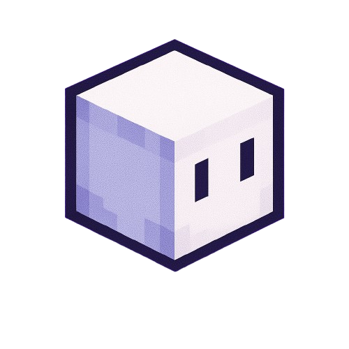

<p align="center">
  <a href="https://claude.ai"></a>
  &nbsp;&nbsp;&nbsp;<strong>&times;</strong>&nbsp;&nbsp;&nbsp;
  <a href="https://unrealizex.com"></a>
</p>

<h1 align="center">Claude 3D Plugins</h1>

<p align="center">
  A marketplace of <a href="https://docs.anthropic.com/s/claude-code">Claude Code</a> plugins for 3D content creation,<br>powered by <a href="https://unrealizex.com">UnrealizeX</a>.
</p>

<p align="center">
  <a href="#plugins">Plugins</a>&nbsp;&nbsp;&bull;&nbsp;&nbsp;<a href="#getting-started">Getting Started</a>&nbsp;&nbsp;&bull;&nbsp;&nbsp;<a href="#how-it-works">How It Works</a>&nbsp;&nbsp;&bull;&nbsp;&nbsp;<a href="CONNECTORS.md">Connectors</a>&nbsp;&nbsp;&bull;&nbsp;&nbsp;<a href="LICENSE">License</a>
</p>

---

## Plugins

| Plugin | Audience | Description |
|--------|----------|-------------|
| [3d-websites](./3d-websites) | Web devs, founders, marketers | Interactive 3D landing pages, product showcases, and portfolio sites with Three.js/WebGL |
| [product-studio](./product-studio) | Product designers, e-commerce, brand teams | Virtual photoshoots, product mockups, colorway exploration, turntable renders |
| [game-assets](./game-assets) | Game devs, indie studios | Game-ready 3D models with LOD levels, batch props, characters, environment pieces |
| [interior-design](./interior-design) | Architects, interior designers | Furniture, decor, room compositions, architectural visualization |
| [robot-simulation-environment](./robot-simulation-environment) | Roboticists, automation engineers | 3D workspace props to Blender/OpenUSD/Isaac Lab for simulation |

## Prerequisites

These plugins generate 3D models through [UnrealizeX](https://unrealizex.com). You'll need a free UnrealizeX account — Claude will prompt you to create one the first time you use a plugin.

## Getting Started

### Claude Code

**Step 1 — Add the marketplace:**

```shell
/plugin marketplace add KalZen-AI/claude-3d-plugins
```

**Step 2 — Install a plugin:**

```shell
/plugin install 3d-websites@claude-3d-plugins
```

Or open the plugin manager with `/plugin`, go to the **Discover** tab, and install from there.

**Step 3 — Connect to UnrealizeX:**

The MCP server is pre-configured in the plugin's `.mcp.json` — no manual setup needed. The first time Claude calls an UnrealizeX tool, an OAuth login will open in your browser. Sign in (or create a free account) and you're connected.

> Run `/[plugin-name]:setup` after installing to walk through the full setup interactively.

### Claude Cowork

**Step 1 — Add the marketplace:**

1. Open the Claude desktop app and switch to the **Cowork** tab
2. Click **Customize** in the left sidebar
3. Click **Browse plugins** → **Personal**
4. Click the **+** button and select **Add marketplace by URL**
5. Paste the repository URL:
   ```
   https://github.com/KalZen-AI/claude-3d-plugins.git
   ```
6. Browse the marketplace and install the plugins you want

**Step 2 — Connect to UnrealizeX:**

1. Go to **Settings → Connectors**
2. Click **Add custom connector**
3. Paste the server URL: `https://unrealizex.com/mcp/`
4. Authenticate with your UnrealizeX account (or [create a free one](https://unrealizex.com))

> Run `/[plugin-name]:setup` after installing to walk through the full setup interactively.

### One-time setup vs. ongoing usage

```
┌─────────────────────────────────────┐
│         ONE-TIME SETUP              │
│                                     │
│  1. Add marketplace                 │
│  2. Install plugin(s)              │
│  3. Connect to UnrealizeX (OAuth)   │
│  4. Run /plugin-name:setup          │
└──────────────┬──────────────────────┘
               │
               ▼
┌─────────────────────────────────────┐
│         ONGOING USAGE               │
│                                     │
│  Just describe what you want.       │
│  Claude + plugin handle the rest.   │
└─────────────────────────────────────┘
```

## How It Works

```
You describe what you want
        |
   Claude Code       ← plugin skills encode domain knowledge
        |
   UnrealizeX MCP    ← AI-powered 3D generation pipeline
        |
  conceptualize → shape → retopology → UV unwrap → texture
        |
   3D asset ready    ← GLB, FBX, USD, or Blender-ready
```

Each plugin adds **domain-specific knowledge** on top of the UnrealizeX pipeline — how to think about game-ready topology, what makes a good product shot, how to structure a Three.js scene, etc. The plugins don't just wrap API calls; they encode the expertise of each domain.

## Project Structure

```
claude-3D-plugins/
├── .claude-plugin/marketplace.json    # plugin registry
├── .mcp.json                          # root MCP config
├── CONNECTORS.md                      # connector reference
├── 3d-websites/                       # per-plugin folders
│   ├── .claude-plugin/plugin.json
│   ├── .mcp.json
│   ├── skills/setup/SKILL.md          # first-run setup skill
│   └── README.md
├── product-studio/
├── game-assets/
├── interior-design/
└── robot-simulation-environment/
```

## License

[MIT](LICENSE)
